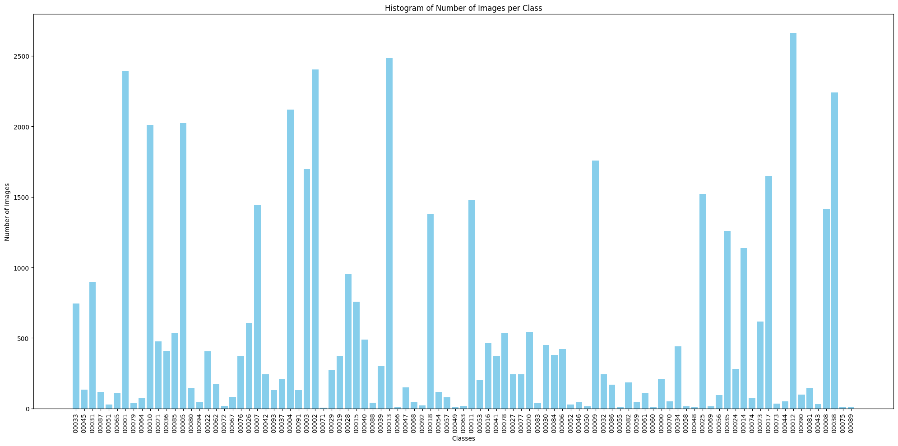

# Traffic Sign Dataset Combined

This repository contains a compiled dataset of traffic signs, created by merging and joining well-known public datasets to enhance the number of classes and total images, thereby improving model robustness and precision. The datasets used in this compilation are as follows:

1. **German Traffic Sign Recognition Dataset (GTSRB)**: [1]
2. **Belgian Traffic Sign Dataset (BTSD)**: [2]
3. **Chinese Traffic Sign Database (TSRD)**: [3]
4. **Croatian Traffic Sign Classification Dataset(MASTIF)**: [4]

## Summary of Datasets

| **Dataset** | **Classes** | **Total Samples** |
|-------------|-------------|-------------------|
| GTSRB       | 43          | 51,839            |
| BTSD        | 62          | 7,095             |
| TSRD        | 58          | 6,164             |
| MASTIF      | 31          | 5,828             |

These datasets contain varying numbers of classes, with some overlapping and some unique to each dataset. To create a unified and comprehensive dataset, we standardized the class IDs by merging similar classes and creating new ones for unique classes. This process resulted in a final dataset with **95 classes** of traffic signs and a total of **65,000 images**.

While the distribution of images across classes is not uniform, as shown in the histogram below, it reflects real-world conditions where frequently occurring signs have more images than less common ones.

## Addressing Class Imbalance

The dataset is highly imbalanced among classes, which can lead to biased model performance favoring the majority classes. To address this, specialized techniques such as balanced sampling, loss function adjustments, and optimization algorithm modifications may be required. These adjustments aim to improve the model’s ability to generalize effectively across all classes, ensuring that minority classes are accurately represented and predicted. Additionally, techniques such as oversampling, undersampling, or synthetic data generation could be explored to mitigate dataset imbalance.

## YOLO Format Conversion

We have another repository containing the script to convert this dataset into the YOLO format. If you are interested, please refer to that repository.

## References

[1] Johannes Stallkamp, Jan Salmen, and Christian Igel. The german traffic sign recognition benchmark: A multi-class classification competition. In Proceedings of the International Joint Conference on Neural Networks (IJCNN), 2011.  
[2] Radu Timofte, Markus Mathias, Rodrigo Benenson, and Luc Van Gool. Traffic sign recognition - how far are we from the solution. In Proceedings of the International Joint Conference on Neural Networks (IJCNN), 2013.  
[3] National Nature Science Foundation of China (NSFC). Chinese traffic sign database. Accessed on 2024-07-24.  
[4] Fran Jurišić, Ivan Filković, and Zoran Kalafatić. Multiple-dataset traffic sign classification with onecnn. IAPR Asian Conference on Pattern Recognition (ACPR), 3, 2015.

